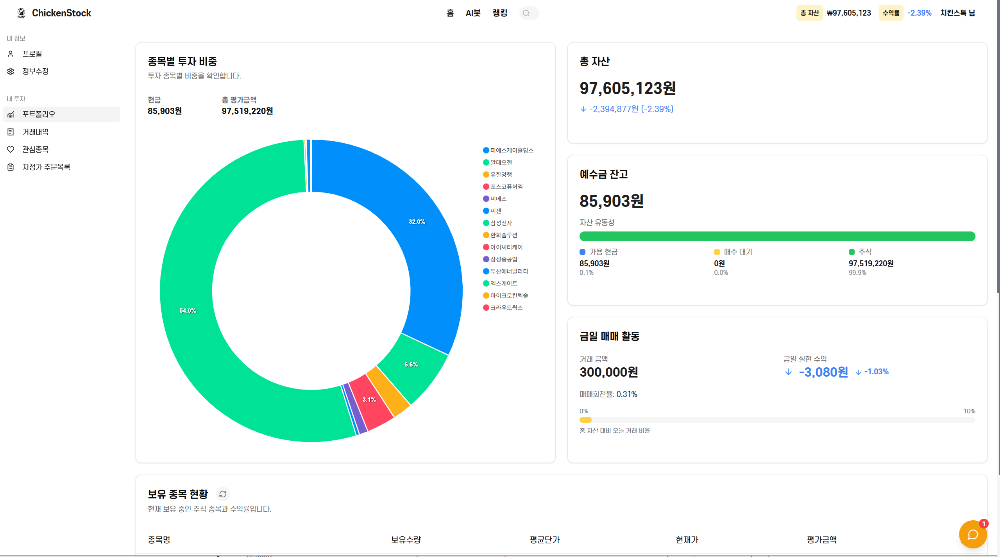
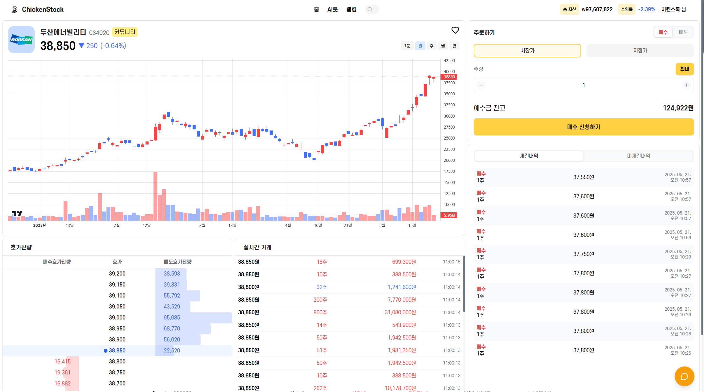

# 🐔 ChickenStock – 모의 투자 플랫폼

> **투자가 처음이라면, ChickenStock과 함께!**  
> 실전 투자를 연습하고 **시장 감각**을 키울 수 있는 **모의주식·자동매매** 서비스입니다.

---

## 📑 목차
1. [서비스 개요](#1-서비스-개요)  
2. [주요 기능](#2-주요-기능)  
3. [서비스 흐름](#3-서비스-흐름)  
4. [팀 구성 및 역할](#4-팀-구성-및-역할)

---

## 1. 서비스 개요
### 1‑1. 서비스 소개
**ChickenStock**은 투자 초보자의 자금을 가상의 증권 시장에 배정하여 매수·매도 경험을 제공하고, 
AI 트레이딩 봇으로 **자동매매**까지 체험할 수 있는 모의투자 플랫폼입니다.  
‘Chicken(겁 많은 투자자)’과 ‘Stock(주식)’의 합성어로, **겁이 나도 안전하게** 투자를 배울 수 있다는 메시지를 담았습니다.

  

### 1‑2. 문제 정의
| 투자자 Pain Point | 기존 서비스들의 문제점 |
|-------------------|-----------------------------------------------|
| 실제 증권계좌 개설 전, **위험 없이 연습**하고 싶다 | 국내 무료 모의투자 시스템은 UI·데이터가 불편 |
| 기존의 모의투자 서비스는 **재미**가 없다 | 기존 모의투자 서비스는 컨텐츠가 부족 |
| 다양한 전략을 실험해 보고 싶지만, **백테스트 환경** 구축이 어렵다 | 실시간 시세·랭킹 기능이 제한적 |

### 1‑3. 기대 효과
1. **Risk‑Free 학습**  
   - 1억 KRW 가상 자산으로 실전과 동일한 호가·체결 환경 제공
2. **전략 검증**  
   - Envelope, Bollinger, DRL‑UTrans 등 **AI 봇**을 즉시 구동
3. **게임화된 동기부여**  
   - **TOP 100 랭킹**과 커뮤니티로 소셜 경쟁/학습 유도

---

## 2. 주요 기능
### 2‑1. 실시간 모의투자
- 한국거래소 **실시간 시세** + 프리·정규·애프터마켓(NXT) 전 구간 주문
- 시장가·지정가·취소 등 **호가별 체결 시뮬레이션**

### 2‑2. AI 자동매매 봇
- **Envelope · Bollinger · Volume‑Pullback · DRL‑UTrans** 전략 내장
- 백엔드에 별도 **Bot Engine** 컨테이너를 두고, REST API로 주문 전송

### 2‑3. 포트폴리오 대시보드
- 자산 구성 도넛차트 · 일별 손익 · 누적 수익률
- 보유 종목/거래내역/수익을 **한눈에**

### 2‑4. 커뮤니티 & 실시간 채팅
- 종목별 토론 게시판, 전 시장 채팅방
- 실시간 알림(주문 체결, 랭킹 변동 등)

---

## 3. 서비스 흐름

### 3‑1. ERD

  

### 3‑2. 시스템 아키텍처

    

- **Backend ↔ Bot Engine** : REST API  
- **Backend ↔ Kiwoom Open API** : 실시간 WebSocket(시세) + REST(데이터)  
- **Bot Engine ↔ Kiwoom Open API** : 실시간 WebSocket(시세) + REST(데이터터)
- **배포** : Docker 이미지 빌드 & Jenkins 파이프라인 → AWS (ECS Fargate) 배포

### 3‑3. 모델링
| 구분 | 목표 | 기법/모델 |
|------|------|-----------|
| **시세 기반 전략** | 중장기 추세 추종·반전 | Envelope, Bollinger Band |
| **거래량·눌림목** | 단기 급등 후 되돌림 공략 | 자가 정의 Volume‑Pullback |
| **강화학습** | 포트폴리오 최적화 | DRL‑UTrans (Transformer × RLlib) |

### 3‑4. 화면 구성
#### Web
| 메인 | 포트폴리오 | 거래내역 |
|------|-----------|----------|
|  |  |  |

| 종목 상세 | 랭킹 | 채팅 |
|-----------|------|------|
|  |  |  |

#### Mobile
| 홈 | 주식 | 랭킹 | 내 기록 |
|------|-----------|----------|----------|
|  |  |  |  |
---

## 4. 팀 구성 및 역할
| 이름 | 포지션 | 담당 업무 |
|------|--------|-----------|
| **이연규** | Team Lead · Backend/AI | FastAPI 설계, 알고리즘 트레이딩 Bot 핵심 로직, DRL-UTrans 모델 학습 |
| 한동민 | Backend | 주문/체결, 외부 API 연동, 인증·인가, REST·WebSocket, Redis |
| 이아영 | Backend | 인증/인가, 랭킹 시스템, Redis Cache, 커뮤니티 |
| 여현승 | Frontend · Web| 실시간 데이터 메모이제이션, 오류 방지용 커스텀 훅, Zustand/TanStack Query 상태 관리 |
| 김효성 | Frontend · Mobile| Kotlin 앱, Coroutine 비동기 처리, FCM 이용한 실시간 알림 기능 |
| 김정우 | Infra | Docker, AWS EC2 배포, Jenkins CI/CD, Nginx Proxy |

---

