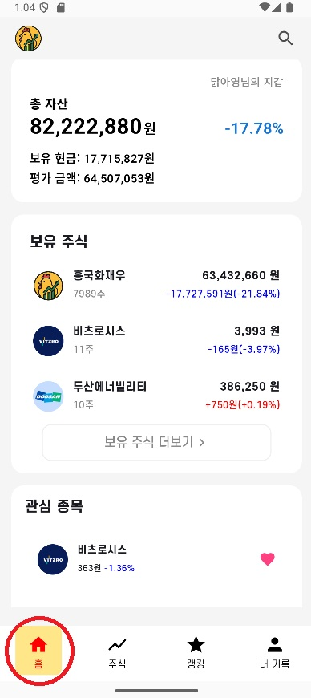
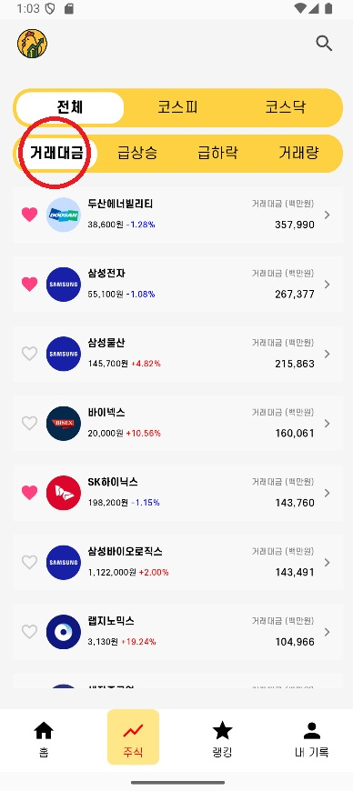
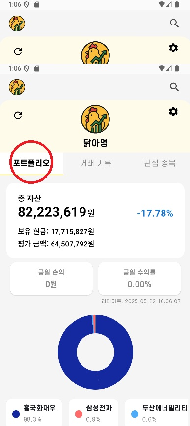
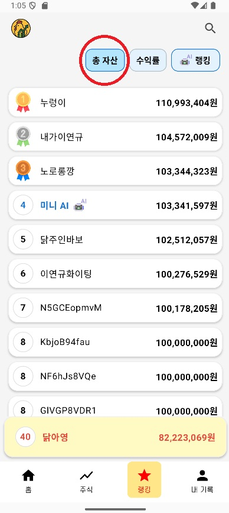

# 🐔ChickenStock 프로젝트 빌드 배포 문서

## 📒 **INDEX**
- [📍 1. 사용 기술 스택 및 설정 정보](#📍-1-사용-기술-스택-및-설정-정보)
- [📍 2. 빌드 시 사용되는 환경변수](#📍-2-빌드-시-사용되는-환경변수)
- [📍 3. 배포 환경 설정 및 특이사항](#📍-3-배포-환경-설정-및-특이사항)
- [📍 4. DB 접속 정보 및 주요 설정 파일](#📍-4-db-접속-정보-및-주요-설정-파일)
- [📍 5. 외부 서비스 연동 정보](#📍-5-외부-서비스-연동-정보)
- [📍 6. DB 덤프파일](#📍-6-db-덤프파일)
- [📍 7. 모바일 시연 시나리오](#📍-7-모바일-시연-시나리오)
- [📍 8. 웹 시연 시나리오](#📍-8-웹-시연-시나리오)

## 📍 1. 사용 기술 스택 및 설정 정보
### JVM 및 웹서버 정보

- **Java Runtime**: JVM 기반 (Spring Boot 애플리케이션)
- **웹서버**: Embedded Tomcat (Spring Boot 내장)
- **WAS**: Spring Boot Embedded Server
- **포트 설정**: 8080 (기본 Spring Boot 포트)

### Spring Boot 설정

```yaml
server:
  forward-headers-strategy: native
  servlet:
    context-path: /
  port: 8080
```

### IDE 버전

- **권장 IDE**: IntelliJ IDEA COMMUNITY
- **Java 버전**: Java 21 (Spring Boot 호환 버전)
- **Gradle**: 빌드 도구

## 📍 2. 빌드 시 사용되는 환경변수

- 환경변수의 직접적인 문의는 `m2insapp@gmail.com` 주소로 부탁드립니다. 감사합니다.

```
GOOGLE_CLIENT_ID =(*비즈니스 계정으로 기재하지 않았습니다.)
GOOGLE_CLIENT_SECRET =(*비즈니스 계정으로 기재하지 않았습니다.)
NAVER_CLIENT_ID =(*비즈니스 계정으로 기재하지 않았습니다.)
NAVER_CLIENT_SECRET =(*비즈니스 계정으로 기재하지 않았습니다.)
KAKAO_CLIENT_ID =(*비즈니스 계정으로 기재하지 않았습니다.)
KAKAO_CLIENT_SECRET =(*비즈니스 계정으로 기재하지 않았습니다.)
JWT_SECRET_KEY =csacpBmjAa5wmi8I8pYGF4AptwOtIDeEnwRFo6ZYsUM4322143rfasdvasdvcawQ3RF12QVFWEASTVBQ345GT23456T2345ASDFAWSEFAWSEFQ2WGF423SADFASDF4QFQWEQWEF-=QWEFQ3WRASFEGF
KIWOOM_APP_KEY = (* 실제 키움증권내 매수 매도 가능한 증권계좌와 직접 연동되어있기에 기재하지 않았습니다.)
KIWOOM_SECRET_KEY = (* 실제 키움증권내 매수 매도 가능한 증권계좌와 직접 연동되어있기에 기재하지 않았습니다.)
MAIL_ID = (* 실제 구글 이메일 ID 이기에 기재하지 않았습니다.)
MAIL_PW = (* 실제 구글 이메일 PW 이기에 기재하지 않았습니다.)
ADMIN_EMAIL=m2insapp@gmail.com
FIREBASE_TYPE=
FIREBASE_PROJECT_ID=
FIREBASE_PRIVATE_KEY_ID=
FIREBASE_PRIVATE_KEY=
FIREBASE_CLIENT_EMAIL=
FIREBASE_CLIENT_ID=
FIREBASE_AUTH_URI=
FIREBASE_TOKEN_URI=
FIREBASE_AUTH_PROVIDER_CERT_URL=
FIREBASE_CLIENT_CERT_URL=
FIREBASE_UNIVERSE_DOMAIN=
```

## 📍 3. 배포 환경 설정 및 특이사항

### Docker 컨테이너 환경

- **docker 환경변수**:

```
BACKEND1_PORT=8084
BACKEND2_PORT=8082
BACKEND3_PORT=8083
FRONTEND_PORT=5173
BUILD_NUMBER=latest
```

- **MySQL 컨테이너**: 6380->6379/tcp
- **Redis 컨테이너**: 6380->6379/tcp
- 컨테이너 간 네트워크 통신을 위한 Docker Compose 설정 필요

```
networks:
  chickenStock-network:
    name: chickenStock-network
    external: true
    driver: bridge

```

### Jenkins 설정

```
pipeline {
    agent any

    environment {
        DOCKER_REGISTRY = credentials('docker-registry-credentials')
        ENV_FILE_ENT = credentials('env-file-credentials-ENT')
        ENVIRO_FILE = credentials('enviro-file-dc')
        BACKEND_ENV_FILE = credentials('backend-env-file-credentials')
        FRONTEND_ENV_FILE = credentials('frontend-env-file-credentials')
        JAVA_HOME = '/usr/lib/jvm/java-21-openjdk-amd64'
    }

    stages {
        stage('Checkout') {
            steps {
                checkout scm
            }
        }
        stage('Setup Frontend Environment') {
            steps {
                withCredentials([
                    file(credentialsId: 'frontend-env-file-credentials', variable: 'FRONTEND_ENV_FILE')
                ]) {
                    sh '''
                        echo "===== Setting up Frontend Environment ====="
                        mkdir -p FE/chickenstock-web
                        chmod -R 700 FE/chickenstock-web
                        cp $FRONTEND_ENV_FILE FE/chickenstock-web/.env
                    '''
                }
            }
        }

         stage('Build and Push Frontend Docker Image') {
            steps {
                script {
                    withCredentials([usernamePassword(
                        credentialsId: 'docker-registry-credentials',
                        usernameVariable: 'DOCKER_USER',
                        passwordVariable: 'DOCKER_PASS'
                    )]) {
                        def frontendImageTag = "kjeongwoo/frontend:${BUILD_NUMBER}"
                        sh """
                            echo '$DOCKER_PASS' | docker login -u '$DOCKER_USER' --password-stdin
                            docker build -t ${frontendImageTag} -f docker/Dockerfile.frontend .
                            docker push ${frontendImageTag}
                        """
                    }
                }
            }
        }
        stage('Setup Environment') {
            steps {
                withCredentials([
                file(credentialsId: 'env-file-credentials-ENT', variable: 'ENV_FILE_ENT'),
                file(credentialsId: 'backend-env-file-credentials', variable: 'BACKEND_ENV_FILE')
                ]) {
                    sh '''
                      echo "===== Setting up Environment ====="
                      mkdir -p BE/src/main/resources
                      chmod -R 700 BE/src/main/resources
                      cp $BACKEND_ENV_FILE BE/.env
                      cp $ENV_FILE_ENT BE/src/main/resources/application.yml
                      echo "===== BE 디렉토리 파일 리스트 ====="
                      ls -al BE/
                    '''
                }
            }
        }

        stage('Build') {
            steps {
                dir('BE') {
                    sh '''
                        echo "===== Building Spring Boot Application ====="
                        chmod +x ./gradlew
                        bash -c '
                            set -o allexport
                            source .env
                            ./gradlew clean build --no-build-cache -x test
                        '
                    '''
                }
            }
        }

        stage('Build and Push Docker Image') {
            steps {
                script {
                    withCredentials([usernamePassword(
                        credentialsId: 'docker-registry-credentials',
                        usernameVariable: 'DOCKER_USER',
                        passwordVariable: 'DOCKER_PASS'
                    )]) {
                        def imageTag = "kjeongwoo/backend:${BUILD_NUMBER}"
                        sh """
                            echo '$DOCKER_PASS' | docker login -u '$DOCKER_USER' --password-stdin
                            docker build -t ${imageTag} -f docker/Dockerfile .
                            docker push ${imageTag}
                        """
                    }
                }
            }
        }

        stage('Deploy') {
            steps {
                withCredentials([file(credentialsId: 'enviro-file-dc', variable: 'ENVIRO_FILE')]) {
                    sh """
                        cp \$ENVIRO_FILE docker/.env
                        chmod 644 docker/.env

                        cd docker
                        docker-compose -f docker-compose.yml down

                        BUILD_NUMBER=${BUILD_NUMBER} docker-compose -f docker-compose.yml up -d

                        docker-compose ps backend1
                        # docker-compose ps backend2
                        # docker-compose ps backend3
                    """
                }
            }
        }

        stage('Docker Test') {
            steps {
                sh '''
                    docker --version
                    docker ps
                '''
            }
        }
    }

    post {
        always {
            sh '''
                rm -f BE/src/main/resources/application-prod.yml
                rm -f BE/src/main/resources/application-oauth.yml
                rm -f docker/.env

                docker container prune -f
                docker image prune -f
            '''
        }
    }
}
```

### Nginx 설정

```
server {
    listen 80;
    server_name chickenstock.shop;
    return 301 https://$host$request_uri;
}

server {
    listen 443 ssl;
    server_name chickenstock.shop;

    ssl_certificate /etc/letsencrypt/live/chickenstock.shop/fullchain.pem;
    ssl_certificate_key /etc/letsencrypt/live/chickenstock.shop/privkey.pem;

    ssl_protocols TLSv1.2 TLSv1.3;
    ssl_prefer_server_ciphers off;

      location ^~ /ws/ {
        proxy_pass http://backend_servers;
        proxy_http_version 1.1;
        proxy_set_header Upgrade $http_upgrade;
        proxy_set_header Connection "upgrade";
        proxy_set_header Host $host;
        proxy_set_header X-Real-IP $remote_addr;
        proxy_set_header X-Forwarded-For $proxy_add_x_forwarded_for;
        proxy_set_header X-Forwarded-Proto $scheme;

        proxy_connect_timeout 30d;
        proxy_send_timeout 30d;
        proxy_read_timeout 30d;
    }

    location ^~ /api/ {
        proxy_pass http://backend_servers;
        proxy_set_header Host $host;
        proxy_set_header X-Real-IP $remote_addr;
        proxy_set_header X-Forwarded-For $proxy_add_x_forwarded_for;
        proxy_set_header X-Forwarded-Proto $scheme;
        proxy_connect_timeout 60s;
        proxy_send_timeout 60s;
        proxy_read_timeout 60s;
    }

    location / {
        proxy_pass http://127.0.0.1:5173;
        proxy_ssl_verify off;
        proxy_set_header Host $host;
        proxy_set_header X-Real-IP $remote_addr;
        proxy_set_header X-Forwarded-For $proxy_add_x_forwarded_for;
        proxy_set_header X-Forwarded-Proto $scheme;
        proxy_connect_timeout 60s;
        proxy_send_timeout 60s;
        proxy_read_timeout 60s;
    }
}

upstream backend_servers {
    server 127.0.0.1:8084;
    # server 127.0.0.1:8082;
    # server 127.0.0.1:8083;
}
```

### FastAPI 서버 설정

- Dockerfile 따로 만들어서 관리, CI/CD에 포함되지 않았음

```
FROM python:3.10-slim

WORKDIR /app

ENV PYTHONDONTWRITEBYTECODE=1 \
    PYTHONUNBUFFERED=1 \
    POETRY_VERSION=2.1.1 \
    POETRY_HOME="/opt/poetry" \
    POETRY_VIRTUALENVS_CREATE=false


RUN apt-get update && apt-get install -y --no-install-recommends \
    gcc \
    apt-utils \
    && pip install --no-cache-dir "poetry==$POETRY_VERSION" \
    && apt-get clean \
    && rm -rf /var/lib/apt/lists/*


COPY pyproject.toml poetry.lock* README.md /app/


RUN poetry install --no-interaction --no-ansi --only main --no-root


COPY . /app/


CMD ["uvicorn", "app.main:app", "--host", "0.0.0.0", "--port", "8000"]


EXPOSE 8000

```

### 외부 도메인 설정

- **서비스 도메인**: `chickenstock.shop`
- **OAuth 리다이렉트 URI**: HTTPS 프로토콜 필수
- SSL 인증서 설정 필요

### 파일 시스템 의존성

- **CSV 파일 경로**: `../etc/csv` (상대 경로)
- 배포 시 해당 디렉토리 구조 확인 필요

## 📍 4. DB 접속 정보 및 주요 설정 파일

### 데이터베이스 연결 정보

```yaml
spring:
  datasource:
    url: jdbc:mysql://mysql-db:3306/chickenstock?useUnicode=true&characterEncoding=utf8&serverTimezone=Asia/Seoul
    driver-class-name: com.mysql.cj.jdbc.Driver
    username: ssafya106
    password: ssafy1234!
```

### JPA/Hibernate 설정

```yaml
spring:
  jpa:
    hibernate:
      ddl-auto: update
    show-sql: false
    database-platform: org.hibernate.dialect.MySQL8Dialect
```

### Redis 캐시 서버

```yaml
spring:
  data:
    redis:
      host: redis-db
      port: 6379
```

### 주요 설정 파일

- **application.yml**: 메인 설정 파일
- **DB 스키마**: `chickenstock` 데이터베이스
- **캐시 서버**: Redis (세션 관리, 임시 데이터 저장)

## 📍 5. 외부 서비스 연동 정보

### 소셜 로그인 서비스

#### Google OAuth2

- **서비스**: Google 소셜 로그인
- **권한 범위**: email, profile
- **리다이렉트 URI**: `https://chickenstock.shop/api/login/oauth2/code/google`

#### Naver OAuth2

- **서비스**: 네이버 소셜 로그인
- **권한 범위**: name, email, profile_image
- **리다이렉트 URI**: `https://chickenstock.shop/api/login/oauth2/code/naver`

#### Kakao OAuth2

- **서비스**: 카카오 소셜 로그인
- **권한 범위**: profile_nickname, account_email, profile_image
- **리다이렉트 URI**: `https://chickenstock.shop/api/login/oauth2/code/kakao`

### Firebase 서비스

- **서비스**: Firebase Cloud Messaging (푸시 알림)
- **설정**: Service Account Key 기반 인증
- **필요 환경변수**:
  - FIREBASE_PROJECT_ID
  - FIREBASE_PRIVATE_KEY
  - FIREBASE_CLIENT_EMAIL 등

### 키움증권 API

- **서비스**: 키움증권 Open API
- **API URL**: `https://api.kiwoom.com`
- **WebSocket URL**: `wss://api.kiwoom.com:10000/api/dostk/websocket`
- **인증**: APP KEY + SECRET KEY 방식

### 이메일 서비스

- **서비스**: Gmail SMTP
- **호스트**: smtp.gmail.com:587
- **인증**: STARTTLS + 앱 비밀번호
- **용도**: 사용자 알림, 인증 메일 발송

### JWT 토큰 관리

- **액세스 토큰 만료**: 9시간 (32400초)
- **리프레시 토큰 만료**: 30일 (2592000초)
- **쿠키 기반 토큰 저장**

### WebSocket 통신

- **실시간 데이터**: 주식 시세, 사용자 알림
- **허용 Origin**: 모든 도메인 (`*`)
- **프로토콜**: WSS (보안 WebSocket)
  - 제출용으로 ORIGIN을 \*로 오픈하였습니다.

## 관리자 정보
- **장 오픈일 08시, 20시 오픈관련된 내용 도착지 메일 주소**
  - **관리자 이메일**: m2insapp@gmail.com

---

**참고사항**

- 모든 외부 API 키는 환경변수로 관리
- HTTPS 통신 필수 (OAuth 리다이렉트, API 호출)
- Docker 컨테이너 환경에서 호스트명 기반 서비스 디스커버리
- 한국 시간대 (Asia/Seoul) 기준으로 모든 시간 데이터 처리


## 📍 6. DB 덤프파일
- **동일 폴더 내 `DB 덤프파일` 폴더에 서비스 각 테이블 및 Column 데이터 EXPORT 되어있습니다.** 

## 📍 7. 모바일 시연 시나리오
### 모바일
#### HOME 화면 [1]
- 
#### STOCKS 화면 [1]
- 
#### MYPAGE 화면 [1]
- 
#### RANKING 화면 [1]
- 

## 📍 8. 웹 시연 시나리오
### **image/WEB/*** 폴더내 각 카테고리별 시연 시나리오 이미지 확인 가능합니다.